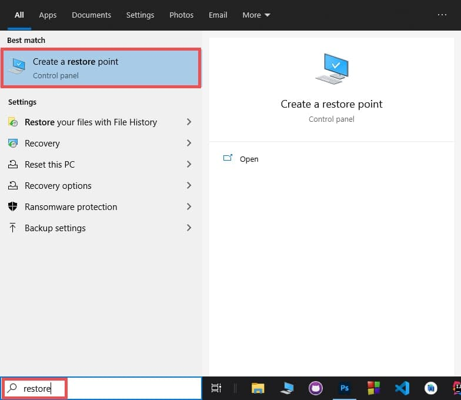
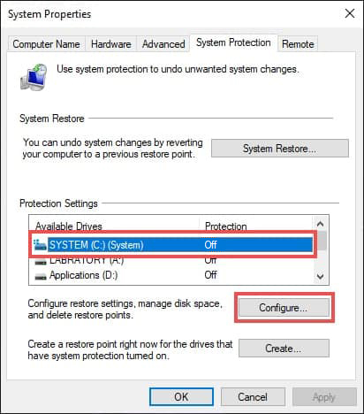
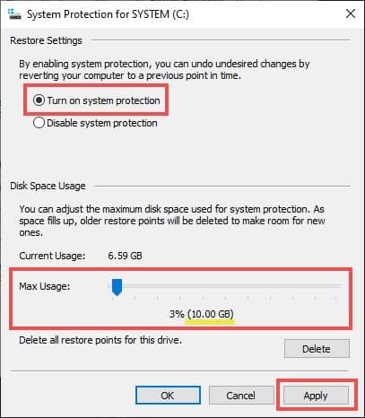

<!-- 
  TODO:
      1. Add separate section for "Troubleshooting".
      2. Add "Latest Release Date".
      3. Add more FAQ
      4. Improve Download Button [Minor]
-->

>[!NOTE]
> **Use [_MagicX Toolbox_](https://github.com/ehsan18t/magicx-toolbox-gui) instead of this script. With the toolbox you can restore/undo any change you made.**
>
> This repository will not be maintained anymore. I am putting everything on the MagicX Toolbox.

>[!WARNING]
>Once you install this tweaks, it can not be uninstalled completely unless you use system restore. So, make sure to create a restore point before install this. 

 

<h1 align="center">Ultimate System Tweaks</h1>

  <strong>Ultimate System Tweaks Collection, endgame tweaks for your 64-bit Windows 10</strong>

 

  <!-- Release Version -->
    
  <!-- Last Updated (Does not show Date, Only month and year)-->
    <!--  -->
  <!-- Downloads Size -->
    
  <!-- Download counts -->
    

&nbsp;
&nbsp;
## 💠 **Introductions**
  This mod aims to make Windows 10 more optimized as well as add some new useful features. This mod will add tons of new registry tweaks, disable useless services, clean the context menu, etc. This mod contains every useful mod and tweaks that available on the internet for Windows 10. (check screenshots)
  
  **NOTE:** Not a good choice for `server` but best for `Home` & `Pro` users.

&nbsp;
&nbsp;
## 📜 **Features**
    * MagicX Toolbox
    * One Click Boost
    * Enables Ultimate Power Plan
    * Tweaks CMD and PowerShell UI
    * Lots of System & Privacy Tweaks
    * Optimize and Clean Context Menu
    * Add Lots of New Options in Context Menu
    * Disables All Unnecessary Services

&nbsp;

**`🔹 Features (Detailed)`**

  
 MagicX Toolbox

    * Option for "After Update Tweaks" to apply after updating windows
    * Option To Control UI Changes
    * Option To Control Context Menu
    * Option To Control Some System Optimization
    * Option To Control Windows Update Settings
    * Option To Downloads Lots of Apps and Mods
    * Option To Update Toolbox via OTA
    * There are tons of features, In short you can control everything of your OS from here

  
 Context Menu Tweaks

    * Removed Scan With Windows Defender
    * Removed Compability Troubleshooting
    * Removed Restore Previous Season
    * Removed Share From Context Menu
    * Removed Give Access
    * Removed Include In Library
    * Removed Open As Portable Device
    * Removed Bitlocker Options
    * Removed Burn Disc Image
    * Removed Print
    * Removed Cast To Device
    * Removed Include In Library From Context Menu
    * Removed Unnecessary File Type From New Context Menu
    * Removed Library From Windows Explorer Side-tab
    * Removed Family Group From Windows Explorer Side-tab
    * Removed Network From Windows Explorer Side-tab
    Note: All the above options can be re-added or removed from Toolbox

    * Added Open Advanced CMD Here (shift)
    * Added Open Advanced PowerShell Here (shift)
    * Added Advanced Personalize Settings
    * Added "Kill Not Responding Tasks" In Tools
    * Added "Delete Temp Files" In Tools
    * Added "Restart Windows Explorer" In Tools
    * Added "Clean Ram Memory" In Tools
    * Added "Clear Clipboard" In Tools
    * Added "Edit HOSTS File" In Tools
    * Added "Empty Recycle Bin" In Tools
    * Added "Show Hide Hidden Items" In Tools
    * Added "Show Hide Super Hidden Items" In Tools
    * Added "Show/hide File Extension" In Tools
    * Added "Computer Management" In System Tools
    * Added "Task Manager" In System Tools
    * Added "Local Group Policy Editor" In System Tools
    * Added "Registry Editor" In System Tools
    * Added "Run" In System Tools
    * Added "Programs & Features" In System Tools
    * Added "Registry Editor" In System Tools
    * Added "msconfig" In System Tools
    * Added "Device Manager" In System Tools
    * Added "Services" In System Tools
    * Added "Control Panel" In System Tools
    * Added "Administrative Tools" To Right Click On This PC
    * Added "Control Panel" To Right Click On This PC
    * Added "Device Manager" To Right Click On This PC
    * Added "Disk Management" To Right Click On This PC
    * Added "Local Group Policy Editor" To Right Click On This PC
    * Added "Programs & Features" To Right Click On This PC
    * Added "Registry Editor" To Right Click On This PC
    * Added "Services" To Right Click On This PC
    * Added "Safe Mode Menu" To Right Click On This PC
    * Added "Tools Menu" To Right Click On This PC
    * Added "System Tools Menu" To Right Click On This PC
    * Added "Turn Off Options" To Right Click On This PC
    * Added "Take Ownership" To All Files
    * Added "Block Access" To All Files
    * Added "Change Icon" To Folder And Drives
    * Added "Copy Folder Content List" To All Files
    * Added "Permanently Delete" To All Files
    * Added "Add To Firewall" To exe Files
    * Added "Delete From Firewall" To exe Files
    * Added "Disk Cleanup" To Drives
    * Added "Windows Batch File" In New Context Menu
    * Added "Windows Command Script" In New Context Menu
    * Added "HTML Document" In New Context Menu
    * Added "PowerShell Script" In New Context Menu
    * Added "Python File" In New Context Menu
    * Added "Registry Entry" In New Context Menu
    * Added "C/C++ File" In New Context Menu
    * Added "JavaScript" In New Context Menu
    * Added "VBscript File" In New Context Menu
    * Added "XML Document" In New Context Menu
    * And much more that I forgot

  
 System & privacy Tweaks

    * Added Additional Windows Search Tweaks
    * Added Edge Patches
    * Added Location Tweaks
    * Added Notepad Tweaks
    * Added OneDrive Tweaks
    * Disabled Add Frequent Files From Quick Access
    * Disabled Add Frequent Folders From Quick Access
    * Disabled Activity History
    * Disabled Ads From Windows Store
    * Disabled Advertising With Bluetooth
    * Disabled Advertising Info
    * Disabled App Telemetry
    * Disabled Apps And Icons Auto Update
    * Disabled Audio File Preview To Improved Response Time
    * Disabled Auto Game Mode
    * Disabled Bing Searches
    * Disabled BSOD Automatic Restart
    * Disabled Camera In Lockscreen
    * Disabled Component Based Log
    * Disabled Conducting Experiment
    * Disabled Customer Experience Improvement
    * Disabled Data Collections
    * Disabled Delta Package Expander Log
    * Disabled Downloaded Files From Being Blocked
    * Disabled Feedback Reminder
    * Disabled Game Bar Tips
    * Disabled Gamebar
    * Disabled Get Suggestion When Using Windows
    * Disabled Handwriting Data Sharing
    * Disabled Handwriting Error Reporting
    * Disabled Hiberboot
    * Disabled Hibernate
    * Disabled Include Drivers In Windows Update
    * Disabled Let Apps Use Advertising Id
    * Disabled Lockscreen Fun Facts, Tips
    * Disabled Logging
    * Disabled Map Data Auto Download
    * Disabled MS Products Auto Update
    * Disabled Narrator
    * Disabled Narrator Online Services
    * Disabled Office Telemetry Or Data Collection For Telemetry Agent
    * Disabled Online Tips And Help For Settings App
    * Disabled Prompt for Admin Privileges
    * Disabled Reserved Storage
    * Disabled Search For Associated In Windows Store
    * Disabled Show Me Tips About Windows
    * Disabled Show Suggestions On Start
    * Disabled Store App Auto Install
    * Disabled Suggested Content In Settings
    * Disabled Suggestions In Timeline
    * Disabled Sync as Default
    * Disabled System Log
    * Disabled Text Message Cloud Backup
    * Disabled Thumbsdb On Network Drives
    * Disabled Transmission Of Typing Info
    * Disabled User Account Login Activity Log
    * Disabled Video File Preview To Improved Response Time
    * Disabled Wcmp Policy
    * Disabled Wd Malware Report Collection
    * Disabled Wd Smart Screen
    * Disabled Wd Submitting Sample Data To Ms
    * Disabled Web Or Being Search (Can be change through Toolbox)
    * Disabled Wfpdiag Etl Log
    * Disabled Windows Error Reporting
    * Disabled Windows Explorer Ads
    * Disabled Windows Feedback
    * Disabled Windows Speech Update
    * Disabled Windows Update Peer & Peernet
    * Disabled Windows Welcome Experienc
    * Enabled Checkbox as Default
    * Enabled Clear Pagefile At Shutdown
    * Enabled Force Use 99% Internet Bandwidth
    * Enabled Full Tpm Owner Authorization
    * Enabled Hidden Files as Default
    * Enabled Long Path
    * Enabled Numlock When Login
    * Enabled Show File Extensions as Default
    * Hide Libraries In Navigation Pane (Can be change through Toolbox)
    * Notify Before Downloading And Installing Updates
    * Prevent Content Delivery Manager From Reverting Feature Configuration
    * Prevent Using Location In Windows Search
    * Prevent Windows 10 From Downloading App Updates Automatically
    * Removed "3D Objects" from File Explorer
    * Removed "_shortcut" suffix from New shortcut
    * Set Do This For All Current Items Checkbox By Default
    * There were lot more but I lost track of them

  
 Service Tweaks

    * BitLocker Drive Encryption Service (BDESVC) - Manual -> Disabled
    * Offline Files (CscService) - Manual -> Disabled
    * Device Management Wireless Application Protocol (WAP) Push message Routing Service (dmwappushservice) - Manual -> Disabled
    * Fax (Fax) - Manual -> Disabled
    * Windows Camera Frame Server (FrameServer) - Manual -> Disabled
    * HV Host Service (HvHost) - Manual -> Disabled
    * Geolocation Service (lfsvc) - Manual -> Disabled
    * TCP/IP NetBIOS Helper (lmhosts) - Manual -> Disabled
    * Microsoft iSCSI Initiator Service (MSiSCSI) - Manual -> Disabled
    * Program Compatibility Assistant Service (PcaSvc) - Manual -> Disabled
    * BranchCache (PeerDistSvc) - Manual -> Disabled
    * Phone Service (PhoneSvc) - Manual -> Disabled
    * Remote Procedure Call (RPC) Locator (RpcLocator) - Manual -> Disabled
    * Smart Card (SCardSvr) - Manual -> Disabled
    * Smart Card Device Enumeration Service (ScDeviceEnum) - Manual -> Disabled
    * Smart Card Removal Policy (SCPolicySvc) - Manual -> Disabled
    * Payments and NFC/SE Manager (SEMgrSvc) - Manual -> Disabled
    * Sensor Data Service (SensorDataService) - Manual -> Disabled
    * Sensor Service (SensorService) - Manual -> Disabled
    * Sensor Monitoring Service (SensrSvc) - Manual -> Disabled
    * Internet Connection Sharing (ICS) (SharedAccess) - Manual -> Disabled
    * Microsoft Windows SMS Router Service. (SmsRouter) - Manual -> Disabled
    * SNMP Trap (SNMPTRAP) - Manual -> Disabled
    * Touch Keyboard and Handwriting Panel Service (TabletInputService) - Manual -> Disabled
    * Distributed Link Tracking Client (TrkWks) - Auto -> Disabled
    * Hyper-V Guest Service Interface (vmicguestinterface) - Manual -> Disabled
    * Hyper-V Heartbeat Service (vmicheartbeat) - Manual -> Disabled
    * Hyper-V Data Exchange Service (vmickvpexchange) - Manual -> Disabled
    * Hyper-V Remote Desktop Virtualization Service (vmicrdv) - Manual -> Disabled
    * Hyper-V Guest Shutdown Service (vmicshutdown) - Manual -> Disabled
    * Hyper-V Time Synchronization Service (vmictimesync) - Manual -> Disabled
    * Hyper-V PowerShell Direct Service (vmicvmsession) - Manual -> Disabled
    * Hyper-V Volume Shadow Copy Requestor (vmicvss) - Manual -> Disabled
    * Windows Remote Management (WS-Management) (WinRM) - Manual -> Disabled
    * Xbox Accessory Management Service (XboxGipSvc) - Manual -> Disabled

&nbsp;
&nbsp;

## ⬇ **Downloads**
</strong>Use this link to download **Ultimate System Tweaks** with most recent changes.</strong>
 
 

&nbsp;
## ⚙️ **Installations**

  
 Step 1: Enable System Restore

&nbsp;

**NOTE:** `Max Usage` can be different depending on your system drive size. But make sure it's 4GB or bigger.

&nbsp;

&#9655;&nbsp; Step 2: Run `Ultimate Tweaks.bat` file
 

**NOTE:** If you face any problem contact me or you can perform `System Restore`.

&nbsp;
## 🖼️ **Screenshots**
<strong><a href="https://magicxmod.github.io/screenshots" target="_blank" rel="noopener">Click Here to View All Screenshots</a></strong>

&nbsp;
## 💡 **Better Alternative?**
<strong>Checkout `Windows 10 Pro MagicX Mod` from <a href="https://magicxmod.github.io/" target="_blank" rel="noopener">here</a>.</strong>

&nbsp;
## ⁉️ **FAQ**

  
 ✔️ Would you take responsibility if this mod cause any problem?

 
  &nbsp; &nbsp; &nbsp;🅰️ Nope, that's out of the question.

  
 ✔️ Can't find 'Bitlocker' or/and 'Hypervision'?

 
  &nbsp; &nbsp; &nbsp;🅰️ I've disabled them. You've to enable them from services settings.

  **Steps:**
  1. press `Win + R` and type `services.msc` then hit `Enter`,&nbsp;  
      &nbsp; **`Or`**&nbsp; &nbsp;  Right click > System Tools > Services.
  2. Enable all services named with `bitlocker`/`hyper`.

  
 ✔️ Why is it a bad option for Windows Server?

 
  &nbsp; &nbsp; &nbsp;🅰️ Because I have disable many services that are essential to run a server.  

  
 ✔️ Can I enable those services so that it works well with Windows Server?

 
  &nbsp; &nbsp; &nbsp;🅰️ Yes, but you've to do it on your own, I won't be able to help you with that.

  
 ✔️ Can I use it on Windows Enterprise?

 
  &nbsp; &nbsp; &nbsp;🅰️ Sure.

&nbsp;
## 🔆 **Need Help?**
**Email:** [ehsan18t@gmail.com](mailto:ehsan18t@gmail.com)\
**Telegram:** [https://t.me/ehsan18t](https://t.me/ehsan18t)\
**Support Group:** [https://t.me/MagicXMod](https://t.me/MagicXMod)

